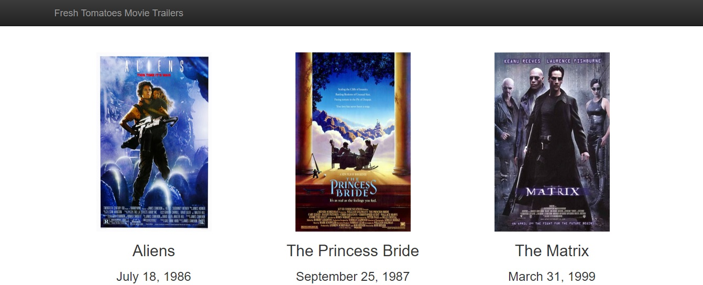

# Movie Website Project by Christy Trevino
This Python software creates a website of my favorite movies as part of the Full Stack Web Developer Nanodegree.  The entertainment.py file contains all the data required for the movies.

## Motivation
To improve and hone my skills in Python and make a kick butt Movie website featuring my favorite movies to share with everyone.

## Build Status

## Screenshots

##  Getting Started
This program is written in Python.  In order to run it you must have Python 2.* installed on your machine.  I also recommend installing Git Bash.  Git Bash is a convenient tool to run this program from.  

These can be found here:
- [Python](https://www.python.org/downloads/)
- [Git](https://git-scm.com/downloads)

Once you have these installed, you should fork this  [repository](https://github.com/downysoft/ud036_StarterCode). Clone the repository to your local machine.

## Usage
Run the program using the following steps:
- Open Git Bash
- Change directories until you are in the directory with the repository
- Do a ls command to make sure you are in the correct directory
    - The `entertainment.py` program will be visible
    - execute the program by using `python entertainment.py` or on 
      some versions of windows `winpty python entertainment.py`
- A website will display showing my favorite movies. 
    - If you click on the posters, the trailers will play for you.

## Code Example
`conan = media.Movie('Conan the Barbarian',
                    'Barbarian takes on sorcerer.',
                    'May 14, 1982',
                    'http://bit.ly/2DJlNow',
                    'https://www.youtube.com/watch?v=xwdYd_RdLCQ')`
                    
`favorite_movies = [aliens, princess_bride, the_matrix,
                   holy_grail, iron_man, conan]`
                   
`fresh_tomatoes.open_movies_page(favorite_movies)`

## Credits
This code originates from Udacity and was forked from [here](https://github.com/udacity/ud036_StarterCode)

## License
The contents of this repository are covered under the [MIT License](https://github.com/downysoft/loganalysis/blob/master/LICENSE).

